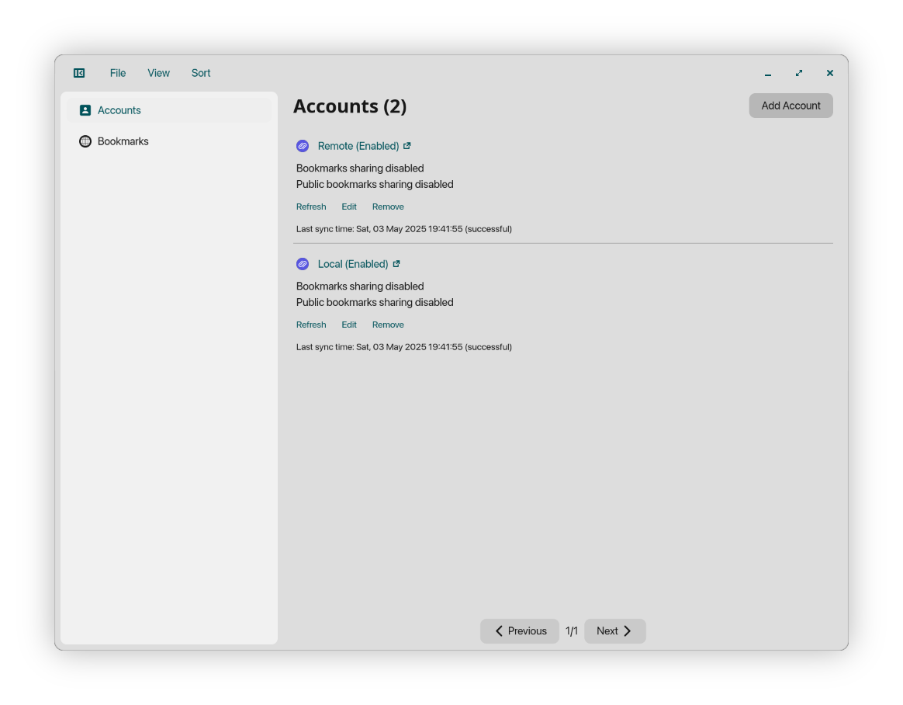

<p align="center">
  
</p>

<p align="center">
    
    
</p>

# cosmicding

> [!NOTE]
> macOS status <https://github.com/vkhitrin/cosmicding/discussions/96>

cosmicding is a [linkding](https://github.com/sissbruecker/linkding) companion app for COSMIC™ Desktop Environment.  
It provides an alternative frontend to linkding based on [libcosmic](https://github.com/pop-os/libcosmic).

While cosmicding was designed for COSMIC™ Desktop Environment, it may "run" cross-platform ([#24](https://github.com/vkhitrin/cosmicding/issues/24)).

Features:

- Support multiple linkding instances (or multiple users on the same instance).
- Aggregate bookmarks locally.
- Add/Edit/Remove bookmarks.
- Search bookmarks based on title, URL, tags, description, and notes.

cosmicding has been tested with linkding releases >= `1.31.0`.

## Installation

### Remote

cosmicding can be installed from remote sources in several ways:

#### Linux

- Download compiled binaries from GitHub release.
- Flatpak (**not yet published**).

#### macOS

- Download DMG from GitHub release.
- Using brew:

  ```shell
  brew tap vkhitrin/tap
  brew install --cask vkhitrin/tap/cosmicding
  ```

### Local Install (compiled binary)

Dependencies (Linux):

- `cargo`
- `just`
- `libxkbcommon-dev`
- `libcosmic`
- `libsqlite3-dev`
- `cosmic-icons`

Dependencies (macOS):

- `cargo`
- `just`
- `libxkbcommon`
- `sqlite3`
- `cosmic-icons` (can be fetched using brew `brew install --HEAD vkhitrin/tap/cosmic-icons-theme`)

Installation:

```shell
# Clone the repository
git clone https://github.com/vkhitrin/cosmicding

# Change directory to the project folder
cd cosmicding

# Build Release version
just build-release

# Install
sudo just install
```

### Local Install (flatpak)

```shell
flatpak-builder --force-clean \
                --sandbox \
                --user \
                --install \
                --install-deps-from=flathub \
                --ccache \
                --mirror-screenshots-url=https://dl.flathub.org/media/ \
                --repo=flatpak-repo builddir \
                res/flatpak/com.vkhitrin.cosmicding
```

## Thanks

- [cosmic-utils](https://github.com/cosmic-utils) organization for their code examples.
- [@sissbruecker](https://github.com/sissbruecker) for creating linkding.
- [system76](https://system76.com) for creating COSMIC, and making it fun to develop for.

Translations:

- Swedish - [@bittin](https://github.com/bittin)
